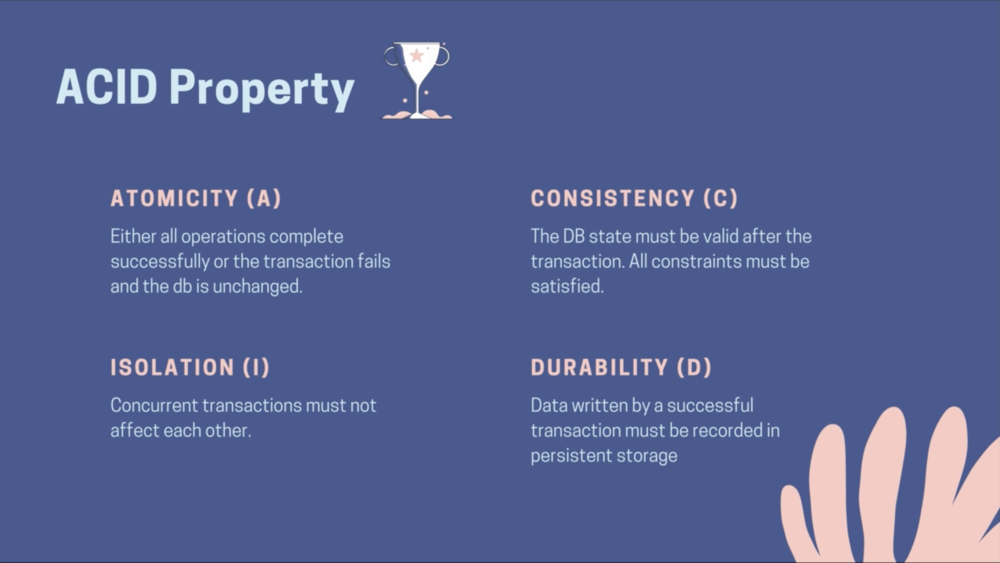
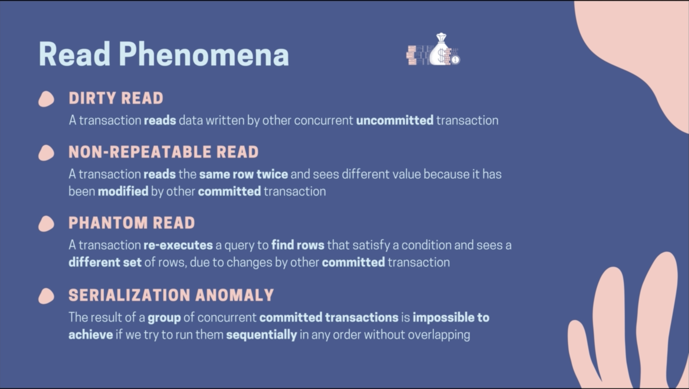
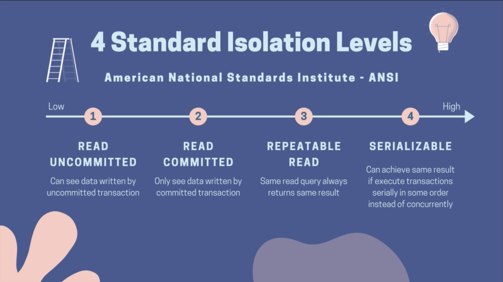
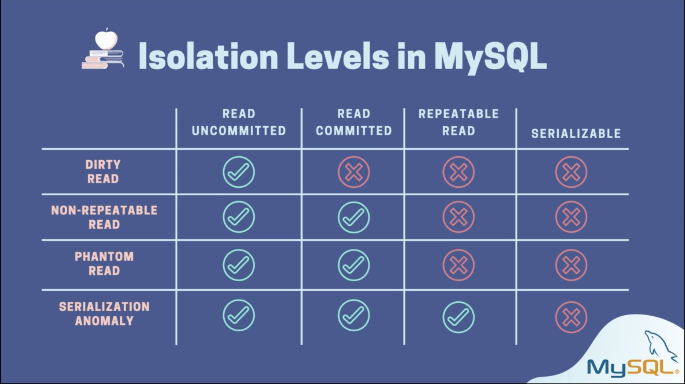
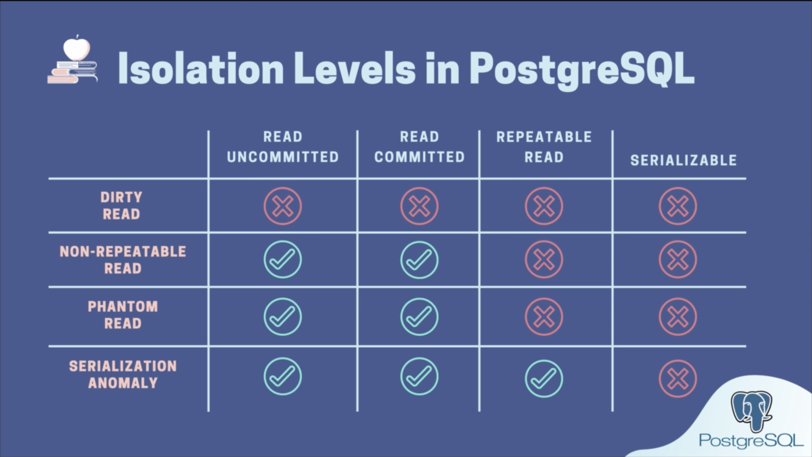
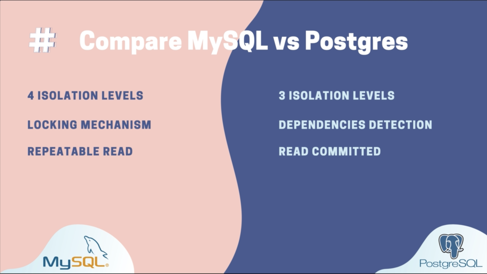

### Transaction Isolation Levels

#### Acid Properties

#### Read Phenomena

#### 4 Standard Isolation levels

#### Isolation Levels in MySQL

#### Isolation Levels in PostgreSQL

#### Compare MySQL vs Postgres
